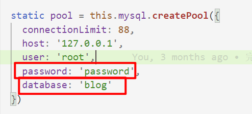

# blogserve

#### 介绍
个人博客后端代码

1.安装模块
npm i

2.生成本地数据库（MySQL）
数据库脚本在sql目录下
create database blog;
source 脚本路径（绝对路径）

3.设置mysql模块的账号密码
/src/controller/database/database.js

4.运行
node app.js

#### 软件架构
软件架构说明